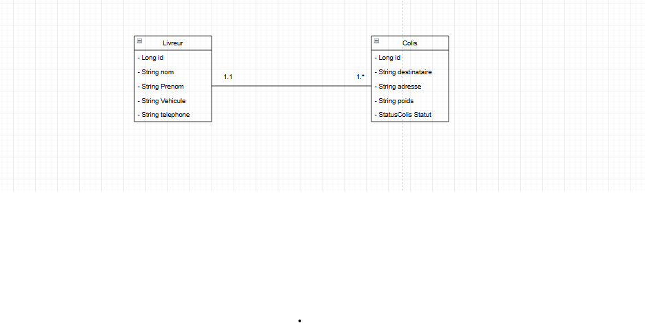

#  Smart Delivery Management System (SDMS) pour SmartLogi

##  Contexte et Objectifs du Projet

La société **SmartLogi** souhaite moderniser et automatiser sa gestion des livraisons. Le système actuel, basé sur des fichiers Excel et des registres papier, est source d'erreurs, de retards, de doubles enregistrements et d'une visibilité très limitée.

Le **Smart Delivery Management System (SDMS)** est la première version d'un système centralisé conçu pour améliorer la **précision**, la **fiabilité** et l'**efficacité** des opérations logistiques en gérant :
1. Les informations sur les colis et les livreurs.
2. La planification et le suivi en temps réel des livraisons.

##  Fonctionnalités Implémentées (User Stories)

Le système implémente les fonctionnalités de gestion de base pour le gestionnaire logistique :

| ID | User Story | Résolution du Problème Actuel |
| :---: | :--- | :--- |
| **US-01** | Gérer les livreurs (**CRUD**) | Centralisation des données, élimination des doublons et des erreurs de saisie manuelles. |
| **US-02** | Enregistrer un colis et l'**assigner** à un livreur | Suivi précis de chaque colis, prévention des pertes ou des enregistrements multiples. |
| **US-03** | **Mettre à jour le statut** d'un colis (ex: Préparation, En Transit, Livré) | Visibilité en temps réel sur l'avancement des livraisons. |
| **US-04** | **Lister** tous les colis assignés à un livreur | Aide à la planification efficace des tournées et réduction des retards. |
| **US-05** | **Supprimer/Corriger** une information erronée | Garantie de la fiabilité et de l'intégrité des données dans le système. |

---

## ️ Stack Technique

Ce projet est construit autour de l'écosystème Spring pour une architecture robuste et maintenable.

* **Langage :** Java (JDK 17+)
* **Frameworks :**
    * **Spring Core :** IoC Container, Injection de Dépendances (DI), Gestion des Beans et Scopes.
    * **Spring Data JPA :** Persistance des entités et opérations CRUD simplifiées.
    * **(Bonus) Spring MVC :** Pour l'exposition d'une API RESTful.
* **Base de Données :** PostgreSQL
* **Gestion de Projet :** Maven
* **Versionnement :** Git / GitHub

##  Détails Techniques

### 1. Modèle de Données (Entités)

Le modèle de données est composé de deux entités principales reliées par une relation `Many-to-One` :

| Entité | Attributs | Description |
| :--- | :--- | :--- |
| **`Livreur`** | `id`, `nom`, `prénom`, `véhicule`, `téléphone` | Représente l'agent de livraison. |
| **`Colis`** | `id`, `destinataire`, `adresse`, `poids`, `statut`, `livreur` | Représente l'objet à livrer et sa liaison avec le livreur. |
| **Relation** | `Colis` <-> `Livreur` | Un `Livreur` peut avoir plusieurs `Colis` (`OneToMany`). Un `Colis` est assigné à un seul `Livreur` (`ManyToOne`). |

### 2. Spring Core et Injection de Dépendances (DI)

L'application utilise les principes fondamentaux de Spring pour la gestion des composants :

* **Définition des Beans :** Toutes les couches (Repository, Service) sont définies comme des Beans Spring.
* **Scopes :** Le scope `Singleton` est le scope par défaut et est utilisé pour les services et repositories.
* **Types de DI utilisés :**
    1.  **Par Constructeur** (approche recommandée).
    2.  **Par Setter**.
    3.  **Par Champ** (`@Autowired` sur le champ).

### 3. Persistance (Spring Data JPA)

La couche d'accès aux données est gérée par des interfaces héritant de `JpaRepository`, minimisant le code d'implémentation du DAO.

##  Démarrage et Configuration

### Pré-requis

* Java Development Kit (JDK) 17 ou supérieur.
* Maven.
* Une instance de base de données **PostgreSQL** active.

### Étapes

1.  **Cloner le Projet :**
    ```bash
    git clone <URL_DU_DEPOT>
    cd SmartLogi-SDMS
    ```
3. **Construction et Exécution :**
    ```bash
    # Construire le projet (téléchargement des dépendances)
    mvn clean install
    
    # Exécuter l'application (Lance la classe Main pour les tests métier ou le serveur Spring Boot)
    mvn spring-boot:run
    ```

##  Tests de la Logique Métier

Les opérations CRUD et la relation entre `Livreur` et `Colis` sont validées via une classe `Main` (ou des tests JUnit) incluant des scénarios comme :
* Création d'un Livreur.
* Création de Colis et assignation au Livreur.
* Mise à jour du statut d'un Colis.
* Récupération de la liste des colis pour un Livreur spécifique.

---

##  Bonus : Utilisation de l'API RESTful (Spring MVC)

Si le module Spring MVC est activé, l'API est accessible via `http://localhost:8080`.

| Endpoint | Méthode | Description | US Associée |
| :--- | :--- | :--- | :---: |
| `/api/livreurs` | `POST` | Crée un nouveau livreur. | US-01 |
| `/api/livreurs/{id}` | `GET` | Récupère les détails d'un livreur. | US-01 |
| `/api/livreurs/{id}/colis`| `GET` | Liste tous les colis assignés à ce livreur. | US-04 |
| `/api/colis` | `POST` | Crée et assigne un nouveau colis. | US-02 |
| `/api/colis/{id}/statut`| `PUT` | Met à jour le statut d'un colis. | US-03 |

Utilisez **Postman** pour tester ces endpoints en envoyant des requêtes avec des corps de messages au format JSON.


##  Diagramme Class


